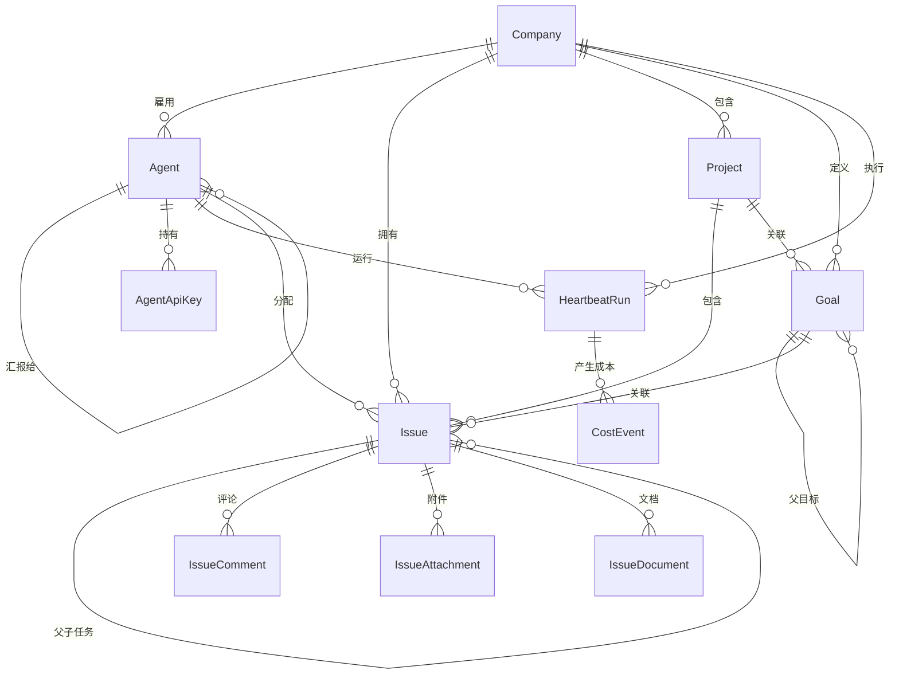
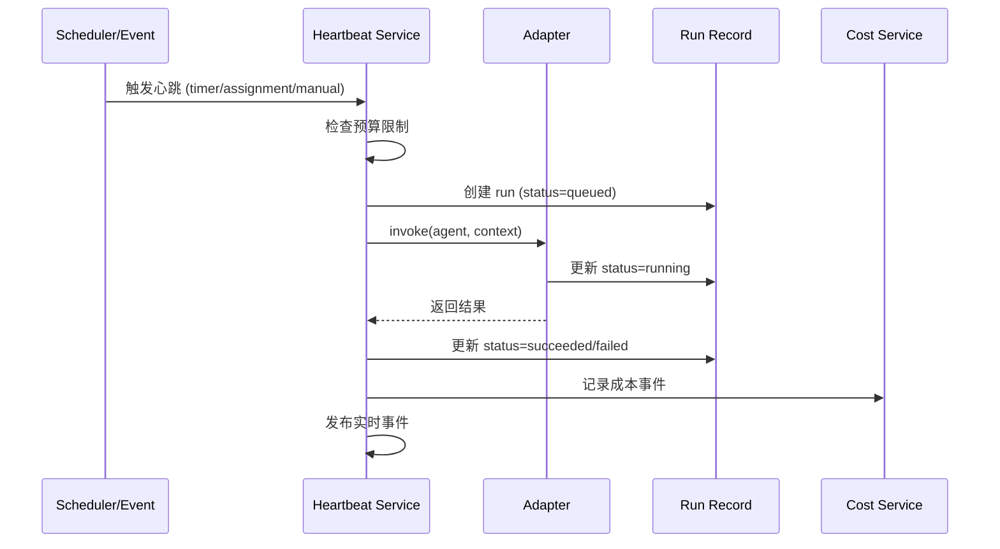
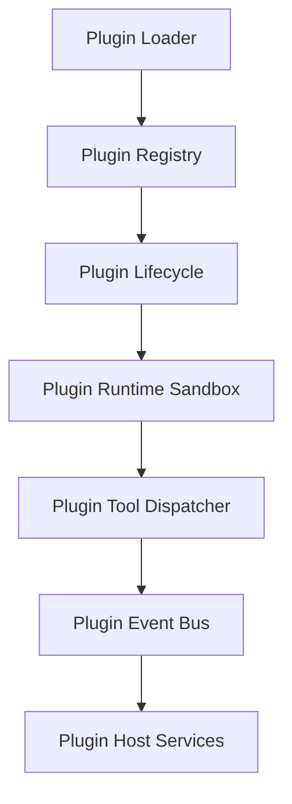

# Paperclip 技术知识库

> **生成时间**: 2026-04-08
> **Commit**: 9cfa37fce3c25988917b0631147413d171bf4e32
> **模式**: FULL_SCAN (首次生成)

---

## 目录

- [#00 项目概述](#00-项目概述)
- [#01 核心领域模型](#01-核心领域模型)
- [#02 API 服务层](#02-api-服务层)
- [#03 适配器系统](#03-适配器系统)
- [#04 心跳与任务执行](#04-心跳与任务执行)
- [#05 预算与成本控制](#05-预算与成本控制)
- [#06 插件系统](#06-插件系统)
- [#07 UI 前端架构](#07-ui-前端架构)
- [#08 数据库设计](#08-数据库设计)
- [#09 部署与运维](#09-部署与运维)
- [#99 项目规范](#99-项目规范)

---

## #00 项目概述

### 00.1 产品定位

**Paperclip 是自主 AI 公司的控制平面 (Control Plane)**。它不是一个 Agent 框架，也不是聊天机器人，而是用于编排和管理由 AI Agent 组成的"公司"的操作系统。

**核心价值主张**：
- 如果 OpenClaw 是员工，Paperclip 就是公司
- 管理业务目标，而非 Pull Requests
- 一个部署，多个公司，完整数据隔离
- 目标驱动的工作流，所有任务都追溯到公司使命

*来源: `doc/GOAL.md:1-20`, `doc/PRODUCT.md:1-30`*

### 00.2 技术栈

| 层级 | 技术选型 |
|------|----------|
| 后端框架 | Node.js 20+ / Express / TypeScript |
| 数据库 | PostgreSQL (Drizzle ORM) |
| 前端框架 | React 18 + Vite + TypeScript |
| 包管理 | pnpm 9.15+ (monorepo) |
| 测试框架 | Vitest + Playwright |
| 数据库模式 | Drizzle Schema + 自动迁移 |

*来源: `package.json:1-50`, `doc/DEVELOPING.md:1-50`*

### 00.3 架构概览

```
┌─────────────────────────────────────────────────────────────┐
│                        UI Layer (React)                      │
│  Dashboard │ Agents │ Issues │ Org Chart │ Costs │ Approvals│
└─────────────────────────────────────────────────────────────┘
                              │
                              ▼
┌─────────────────────────────────────────────────────────────┐
│                     API Layer (Express)                      │
│     /api/companies │ /api/agents │ /api/issues │ ...        │
└─────────────────────────────────────────────────────────────┘
                              │
                              ▼
┌─────────────────────────────────────────────────────────────┐
│                    Service Layer                             │
│  Companies │ Agents │ Issues │ Heartbeat │ Budgets │ ...    │
└─────────────────────────────────────────────────────────────┘
                              │
                              ▼
┌─────────────────────────────────────────────────────────────┐
│                    Data Layer (Drizzle)                      │
│  PostgreSQL (External) │ PGlite (Embedded)                   │
└─────────────────────────────────────────────────────────────┘
                              │
                              ▼
┌─────────────────────────────────────────────────────────────┐
│                   Adapter Layer                              │
│  Process Adapter │ HTTP Adapter │ Claude Local │ Codex │ ...│
└─────────────────────────────────────────────────────────────┘
```

*来源: `AGENTS.md:30-45`*

### 00.4 Monorepo 结构

```
paperclip/
├── server/           # Express REST API 和编排服务
├── ui/               # React + Vite Board UI
├── packages/
│   ├── db/           # Drizzle schema, migrations, DB clients
│   ├── shared/       # 共享类型、常量、验证器
│   ├── adapters/     # Agent 适配器实现 (Claude, Codex, Cursor 等)
│   ├── adapter-utils/# 适配器共享工具
│   └── plugins/      # 插件系统包
├── cli/              # Paperclip CLI 工具
├── doc/              # 产品和运营文档
├── skills/           # Agent 技能包
└── tests/            # E2E 和发布冒烟测试
```

*来源: `AGENTS.md:30-50`*

### 00.5 核心能力

| 能力 | 描述 |
|------|------|
| 组织架构 | 层级结构、角色、汇报线。Agent 有老板、头衔和工作描述 |
| 目标对齐 | 每个任务追溯到公司使命。Agent 知道做什么和为什么 |
| 心跳调度 | Agent 按计划唤醒、检查工作、执行。委托沿组织架构上下流动 |
| 成本控制 | 每月预算。达到限制时停止。无失控成本 |
| 治理 | Board 可以批准雇佣、覆盖策略、暂停或终止任何 Agent |
| 活动日志 | 所有变更操作记录审计日志，不可变 |

*来源: `README.md:80-120`, `doc/SPEC-implementation.md:1-100`*

---

## #01 核心领域模型

### 01.1 实体关系图



*来源: `doc/SPEC-implementation.md:140-300`, `packages/db/src/schema/index.ts`*

### 01.2 Company (公司)

**定位**: 一阶实体，所有业务实体的顶级容器。

**核心字段**:
| 字段 | 类型 | 说明 |
|------|------|------|
| `id` | uuid | 主键 |
| `name` | text | 公司名称 |
| `status` | enum | `active` \| `paused` \| `archived` |
| `issuePrefix` | text | Issue 前缀 (如 "PAP") |
| `budgetMonthlyCents` | int | 月度预算（分） |
| `spentMonthlyCents` | int | 当月已花费（分） |
| `requireBoardApprovalForNewAgents` | boolean | 新 Agent 是否需要 Board 审批 |

**不变量**: 每个业务记录必须属于且仅属于一个公司。

*来源: `packages/db/src/schema/companies.ts:1-40`, `doc/SPEC-implementation.md:150-165`*

### 01.3 Agent (代理)

**定位**: 公司的员工，由 AI Agent 担任。

**核心字段**:
| 字段 | 类型 | 说明 |
|------|------|------|
| `id` | uuid | 主键 |
| `companyId` | uuid | 所属公司 |
| `name` | text | Agent 名称 |
| `role` | text | 角色 (ceo, cto, engineer 等) |
| `title` | text | 职位头衔 |
| `status` | enum | `idle` \| `running` \| `paused` \| `error` \| `terminated` \| `pending_approval` |
| `reportsTo` | uuid | 汇报对象 (Manager) |
| `adapterType` | text | 适配器类型 |
| `adapterConfig` | jsonb | 适配器配置 |
| `runtimeConfig` | jsonb | 运行时配置 |
| `budgetMonthlyCents` | int | 月度预算 |
| `spentMonthlyCents` | int | 当月已花费 |

**状态机**:
```
idle ──► running ──► idle
  │          │
  │          ▼
  │       error
  │          │
  ▼          ▼
paused ◄─────┘
  │
  ▼
terminated (不可逆)
```

**不变量**:
- Agent 和 Manager 必须属于同一公司
- 汇报关系不能形成环
- `terminated` 状态的 Agent 不可恢复

*来源: `packages/db/src/schema/agents.ts:1-50`, `server/src/services/agents.ts:1-100`*

### 01.4 Issue (任务)

**定位**: 核心任务实体，所有工作跟踪的单位。

**核心字段**:
| 字段 | 类型 | 说明 |
|------|------|------|
| `id` | uuid | 主键 |
| `companyId` | uuid | 所属公司 |
| `projectId` | uuid | 所属项目 |
| `parentId` | uuid | 父任务 |
| `goalId` | uuid | 关联目标 |
| `title` | text | 任务标题 |
| `status` | enum | `backlog` \| `todo` \| `in_progress` \| `in_review` \| `blocked` \| `done` \| `cancelled` |
| `priority` | enum | `critical` \| `high` \| `medium` \| `low` |
| `assigneeAgentId` | uuid | 分配的 Agent |
| `checkoutRunId` | uuid | 检出运行的 Heartbeat |
| `executionRunId` | uuid | 执行运行的 Heartbeat |
| `executionWorkspaceId` | uuid | 执行工作区 |
| `identifier` | text | 唯一标识符 (如 "PAP-123") |

**状态机**:
```
backlog ──► todo ──► in_progress ──► in_review ──► done
  │           │           │              │
  │           ▼           ▼              │
  │       blocked ◄───────┘              │
  │           │                          │
  ▼           ▼                          ▼
cancelled ◄─────────────────────────────┘
```

**不变量**:
- 单一负责人
- 任务必须通过 `goal_id`、`parent_id` 或项目-目标链接追溯到公司目标链
- `in_progress` 状态必须有负责人
- 终态: `done` \| `cancelled`

*来源: `packages/db/src/schema/issues.ts:1-80`, `doc/SPEC-implementation.md:180-220`*

### 01.5 HeartbeatRun (心跳运行)

**定位**: Agent 每次心跳执行的记录。

**核心字段**:
| 字段 | 类型 | 说明 |
|------|------|------|
| `id` | uuid | 主键 |
| `companyId` | uuid | 所属公司 |
| `agentId` | uuid | 执行的 Agent |
| `invocationSource` | text | 调用来源: `on_demand` \| `timer` \| `assignment` |
| `status` | enum | `queued` \| `running` \| `succeeded` \| `failed` \| `cancelled` \| `timed_out` |
| `startedAt` | timestamptz | 开始时间 |
| `finishedAt` | timestamptz | 结束时间 |
| `sessionIdBefore` | text | 运行前会话 ID |
| `sessionIdAfter` | text | 运行后会话 ID |
| `exitCode` | int | 进程退出码 |
| `usageJson` | jsonb | Token 使用量 |
| `resultJson` | jsonb | 执行结果 |

*来源: `packages/db/src/schema/heartbeat_runs.ts:1-50`, `server/src/services/heartbeat.ts:1-100`*

### 01.6 Goal (目标)

**定位**: 层级目标体系，连接公司使命到具体任务。

**核心字段**:
| 字段 | 类型 | 说明 |
|------|------|------|
| `id` | uuid | 主键 |
| `companyId` | uuid | 所属公司 |
| `title` | text | 目标标题 |
| `level` | enum | `company` \| `team` \| `agent` \| `task` |
| `parentId` | uuid | 父目标 |
| `ownerAgentId` | uuid | 负责人 |
| `status` | enum | `planned` \| `active` \| `achieved` \| `cancelled` |

**不变量**: 每个公司至少有一个根级别的 `company` 目标。

*来源: `doc/SPEC-implementation.md:170-180`*

### 01.7 Approval (审批)

**定位**: 治理审批流。

**核心字段**:
| 字段 | 类型 | 说明 |
|------|------|------|
| `id` | uuid | 主键 |
| `companyId` | uuid | 所属公司 |
| `type` | enum | `hire_agent` \| `approve_ceo_strategy` |
| `status` | enum | `pending` \| `approved` \| `rejected` \| `cancelled` |
| `payload` | jsonb | 审批内容 |
| `decidedByUserId` | text | 决策者 |

*来源: `doc/SPEC-implementation.md:260-280`*

---

## #02 API 服务层

### 02.1 路由架构

**基础路径**: `/api`

**路由模块**:
| 模块 | 路径 | 功能 |
|------|------|------|
| `companyRoutes` | `/companies` | 公司 CRUD |
| `agentRoutes` | `/companies/:companyId/agents` | Agent 管理 |
| `issueRoutes` | `/companies/:companyId/issues` | 任务管理 |
| `projectRoutes` | `/companies/:companyId/projects` | 项目管理 |
| `goalRoutes` | `/companies/:companyId/goals` | 目标管理 |
| `approvalRoutes` | `/companies/:companyId/approvals` | 审批流 |
| `costRoutes` | `/companies/:companyId/costs` | 成本统计 |
| `dashboardRoutes` | `/companies/:companyId/dashboard` | 仪表盘 |
| `activityRoutes` | `/companies/:companyId/activity` | 活动日志 |
| `secretRoutes` | `/secrets` | 密钥管理 |
| `healthRoutes` | `/health` | 健康检查 |

*来源: `server/src/routes/index.ts:1-30`*

### 02.2 服务层模式

每个领域实体对应一个服务工厂函数，注入数据库实例：

```typescript
// server/src/services/agents.ts
export function agentService(db: Db) {
  return {
    list: async (companyId: string) => { ... },
    getById: async (id: string) => { ... },
    create: async (companyId: string, data) => { ... },
    update: async (id: string, data) => { ... },
    pause: async (id: string, reason) => { ... },
    resume: async (id: string) => { ... },
    terminate: async (id: string) => { ... },
    // ...
  };
}
```

*来源: `server/src/services/agents.ts:150-200`*

### 02.3 认证与授权

**认证模式**:

| 模式 | 适用场景 | 说明 |
|------|----------|------|
| `local_trusted` | 本地开发 | 单用户隐式 Board 权限 |
| `authenticated` | 生产部署 | Session 认证 + API Key |

**权限矩阵 (V1)**:

| 操作 | Board | Agent |
|------|-------|-------|
| 创建公司 | ✓ | ✗ |
| 创建 Agent | ✓ (直接) | 需审批 |
| 暂停/恢复 Agent | ✓ | ✗ |
| 创建/更新任务 | ✓ | ✓ |
| 审批策略/雇佣 | ✓ | ✗ |
| 上报成本 | ✓ | ✓ |
| 设置预算 | ✓ | ✗ |

*来源: `doc/SPEC-implementation.md:380-450`*

### 02.4 原子任务检出

**端点**: `POST /issues/:issueId/checkout`

**请求体**:
```json
{
  "agentId": "uuid",
  "expectedStatuses": ["todo", "backlog", "blocked", "in_review"]
}
```

**服务端行为**:
1. 单条 SQL UPDATE: `WHERE id = ? AND status IN (?) AND (assignee_agent_id IS NULL OR assignee_agent_id = :agentId)`
2. 若更新行数为 0，返回 `409` 冲突
3. 成功检出设置 `assignee_agent_id`, `status = in_progress`, `started_at`

*来源: `doc/SPEC-implementation.md:320-340`, `server/src/services/issues.ts:400-500`*

### 02.5 错误语义

| 状态码 | 含义 |
|--------|------|
| `400` | 验证错误 |
| `401` | 未认证 |
| `403` | 未授权 |
| `404` | 未找到 |
| `409` | 状态冲突 (检出冲突、无效转换) |
| `422` | 语义规则违反 |
| `500` | 服务器错误 |

*来源: `doc/SPEC-implementation.md:370-380`*

---

## #03 适配器系统

### 03.1 适配器接口

```typescript
interface AgentAdapter {
  invoke(agent: Agent, context: InvocationContext): Promise<InvokeResult>;
  status(run: HeartbeatRun): Promise<RunStatus>;
  cancel(run: HeartbeatRun): Promise<void>;
}
```

*来源: `server/src/adapters/types.ts:1-30`, `doc/SPEC-implementation.md:450-480`*

### 03.2 内置适配器

#### Process Adapter

**配置结构**:
```json
{
  "command": "string",
  "args": ["string"],
  "cwd": "string",
  "env": {"KEY": "VALUE"},
  "timeoutSec": 900,
  "graceSec": 15
}
```

**行为**:
- 启动子进程
- 流式输出 stdout/stderr 到运行日志
- 根据退出码/超时标记运行状态
- 取消时先发送 SIGTERM，grace 期后 SIGKILL

#### HTTP Adapter

**配置结构**:
```json
{
  "url": "https://...",
  "method": "POST",
  "headers": {"Authorization": "Bearer ..."},
  "timeoutMs": 15000,
  "payloadTemplate": {"agentId": "{{agent.id}}", "runId": "{{run.id}}"}
}
```

**行为**:
- 通过出站 HTTP 请求调用
- 2xx 表示接受
- 非 2xx 标记调用失败
- 可选回调端点支持异步完成更新

*来源: `doc/SPEC-implementation.md:480-520`*

### 03.3 外部适配器

**已支持的本地适配器**:
| 适配器 | 包名 | 说明 |
|--------|------|------|
| Claude Local | `@paperclipai/claude-local` | Claude Code 本地运行 |
| Codex Local | `@paperclipai/codex-local` | OpenAI Codex 本地运行 |
| Cursor | `@paperclipai/cursor-local` | Cursor IDE 集成 |
| Gemini Local | `@paperclipai/gemini-local` | Google Gemini 本地 |
| OpenClaw Gateway | `@paperclipai/openclaw-gateway` | OpenClaw HTTP 网关 |

*来源: `packages/adapters/` 目录结构*

### 03.4 适配器注册

```typescript
// server/src/adapters/registry.ts
export function getServerAdapter(adapterType: string): AgentAdapter | null {
  // 内置适配器
  if (adapterType === "process") return processAdapter;
  if (adapterType === "http") return httpAdapter;

  // 插件适配器
  return loadPluginAdapter(adapterType);
}
```

*来源: `server/src/adapters/registry.ts`, `server/src/adapters/index.ts`*

---

## #04 心跳与任务执行

### 04.1 心跳执行流程



*来源: `server/src/services/heartbeat.ts:1-200`*

### 04.2 工作区解析

**工作区模式**:
| 模式 | 说明 |
|------|------|
| `project_primary` | 项目主工作区 |
| `task_session` | 任务隔离工作区 |
| `agent_home` | Agent 默认回退工作区 |

**解析优先级**:
1. Issue 指定的 `executionWorkspaceId`
2. Project 的主工作区
3. Agent 默认工作区 (`~/.paperclip/instances/default/workspaces/<agent-id>`)

*来源: `server/src/services/heartbeat.ts:200-350`*

### 04.3 会话管理

**会话持久化**:
- `agentTaskSessions` 表存储每个任务的会话状态
- `sessionIdBefore` / `sessionIdAfter` 跟踪会话连续性
- 支持会话压缩策略，防止上下文无限增长

**会话恢复**:
```typescript
function buildExplicitResumeSessionOverride(input: {
  resumeFromRunId: string;
  resumeRunSessionIdBefore: string | null;
  resumeRunSessionIdAfter: string | null;
  taskSession: ResumeSessionRow | null;
  sessionCodec: AdapterSessionCodec;
}) { ... }
```

*来源: `server/src/services/heartbeat.ts:150-250`*

### 04.4 唤醒机制

**唤醒来源**:
| 来源 | 触发条件 |
|------|----------|
| `timer` | 定时调度 |
| `assignment` | 任务分配 |
| `on_demand` | 手动触发 |
| `automation` | 自动化规则 |

**唤醒上下文**:
```typescript
interface WakeupOptions {
  source?: "timer" | "assignment" | "on_demand" | "automation";
  triggerDetail?: "manual" | "ping" | "callback" | "system";
  reason?: string | null;
  payload?: Record<string, unknown> | null;
  contextSnapshot?: Record<string, unknown>;
}
```

*来源: `server/src/services/heartbeat.ts:80-150`*

---

## #05 预算与成本控制

### 05.1 预算层级

| 层级 | 说明 |
|------|------|
| Company | 公司月度预算 |
| Agent | Agent 月度预算 |
| Project | 可选项目预算 |

*来源: `doc/SPEC-implementation.md:550-570`*

### 05.2 成本事件模型

**表**: `cost_events`

| 字段 | 类型 | 说明 |
|------|------|------|
| `companyId` | uuid | 所属公司 |
| `agentId` | uuid | 产生的 Agent |
| `issueId` | uuid | 关联任务 |
| `provider` | text | 提供商 (openai, anthropic 等) |
| `model` | text | 模型名称 |
| `inputTokens` | int | 输入 Token |
| `outputTokens` | int | 输出 Token |
| `costCents` | int | 成本（分） |
| `occurredAt` | timestamptz | 发生时间 |

*来源: `doc/SPEC-implementation.md:250-260`, `packages/db/src/schema/cost_events.ts`*

### 05.3 执行规则

| 阈值 | 行为 |
|------|------|
| 80% | 软告警 |
| 100% | 硬限制：自动暂停 Agent，阻止新检出/调用 |

**硬限制执行**:
```typescript
// 预算检查
const budgetCheck = await budgetService.checkEnforcement(
  companyId,
  agentId,
  'execution'
);
if (budgetCheck.blocked) {
  throw conflict('Agent budget exhausted');
}
```

*来源: `doc/SPEC-implementation.md:570-590`*

### 05.4 月度窗口

**计算规则**: UTC 日历月
- 开始: 当月 1 日 00:00:00 UTC
- 结束: 下月 1 日 00:00:00 UTC

```typescript
function currentUtcMonthWindow(now = new Date()) {
  const year = now.getUTCFullYear();
  const month = now.getUTCMonth();
  return {
    start: new Date(Date.UTC(year, month, 1, 0, 0, 0, 0)),
    end: new Date(Date.UTC(year, month + 1, 1, 0, 0, 0, 0)),
  };
}
```

*来源: `server/src/services/agents.ts:60-70`, `server/src/services/companies.ts:40-50`*

---

## #06 插件系统

### 06.1 插件架构



### 06.2 插件生命周期

**核心表**:
| 表 | 说明 |
|-----|------|
| `plugins` | 插件注册信息 |
| `pluginConfig` | 插件配置 |
| `pluginState` | 插件状态 |
| `pluginJobs` / `pluginJobRuns` | 后台任务 |
| `pluginLogs` | 插件日志 |
| `pluginWebhookDeliveries` | Webhook 投递记录 |

*来源: `packages/db/src/schema/index.ts:55-70`*

### 06.3 服务层

| 服务 | 职责 |
|------|------|
| `pluginLoader` | 加载和验证插件 |
| `pluginLifecycle` | 安装/启用/禁用/卸载 |
| `pluginRuntimeSandbox` | 隔离执行环境 |
| `pluginToolDispatcher` | 工具调用分发 |
| `pluginEventBus` | 事件发布订阅 |
| `pluginJobScheduler` | 后台任务调度 |

*来源: `server/src/services/` 目录结构*

---

## #07 UI 前端架构

### 07.1 技术栈

| 层级 | 技术 |
|------|------|
| 框架 | React 18 |
| 构建 | Vite |
| 路由 | React Router |
| 状态管理 | React Context |
| 样式 | Tailwind CSS + shadcn/ui |
| 类型 | TypeScript |

*来源: `ui/package.json`*

### 07.2 页面结构

| 页面 | 路径 | 功能 |
|------|------|------|
| Dashboard | `/` | 公司概览、活动统计 |
| Companies | `/companies` | 公司列表/创建 |
| Org Chart | `/companies/:id/org` | 组织架构图 |
| Agents | `/companies/:id/agents` | Agent 列表 |
| Agent Detail | `/companies/:id/agents/:agentId` | Agent 详情 |
| Issues | `/companies/:id/tasks` | 任务看板 |
| Issue Detail | `/issues/:issueId` | 任务详情 |
| Costs | `/companies/:id/costs` | 成本仪表盘 |
| Approvals | `/companies/:id/approvals` | 审批队列 |
| Activity | `/companies/:id/activity` | 活动日志 |
| Plugin Manager | `/plugins` | 插件管理 |

*来源: `ui/src/pages/` 目录结构*

### 07.3 API 客户端

```typescript
// ui/src/api/
export const api = {
  companies: {
    list: () => fetch('/api/companies'),
    get: (id) => fetch(`/api/companies/${id}`),
    create: (data) => fetch('/api/companies', { method: 'POST', body: JSON.stringify(data) }),
  },
  agents: { ... },
  issues: { ... },
  // ...
};
```

*来源: `ui/src/api/`*

### 07.4 全局状态

**Company Context**: 公司选择器上下文，用于公司范围页面的数据同步。

```typescript
// ui/src/context/
const CompanyContext = createContext<{
  companyId: string | null;
  setCompanyId: (id: string) => void;
}>({ ... });
```

---

## #08 数据库设计

### 08.1 Schema 结构

**核心模块** (`packages/db/src/schema/`):

| 模块 | 主要表 |
|------|--------|
| 认证 | `authUsers`, `authSessions`, `authAccounts` |
| 公司 | `companies`, `companyLogos`, `companyMemberships` |
| Agent | `agents`, `agentApiKeys`, `agentRuntimeState`, `agentTaskSessions` |
| 任务 | `issues`, `issueComments`, `issueAttachments`, `issueDocuments` |
| 心跳 | `heartbeatRuns`, `heartbeatRunEvents` |
| 成本 | `costEvents`, `financeEvents` |
| 审批 | `approvals`, `approvalComments` |
| 活动 | `activityLog` |
| 密钥 | `companySecrets`, `companySecretVersions` |
| 插件 | `plugins`, `pluginConfig`, `pluginJobs`, `pluginLogs` |

*来源: `packages/db/src/schema/index.ts`*

### 08.2 关键索引

```typescript
// agents
index("agents_company_status_idx").on(table.companyId, table.status);
index("agents_company_reports_to_idx").on(table.companyId, table.reportsTo);

// issues
index("issues_company_status_idx").on(table.companyId, table.status);
index("issues_company_assignee_status_idx").on(table.companyId, table.assigneeAgentId, table.status);
index("issues_company_parent_idx").on(table.companyId, table.parentId);
uniqueIndex("issues_identifier_idx").on(table.identifier);

// heartbeat_runs
index("heartbeat_runs_company_agent_started_idx").on(table.companyId, table.agentId, table.startedAt);

// cost_events
index("cost_events_company_occurred_idx").on(table.companyId, table.occurredAt);
```

*来源: `packages/db/src/schema/agents.ts`, `packages/db/src/schema/issues.ts`, `packages/db/src/schema/heartbeat_runs.ts`*

### 08.3 迁移机制

**生成迁移**:
```bash
pnpm db:generate
```

**执行迁移**:
```bash
pnpm db:migrate
```

**说明**:
- Drizzle migrations 是 schema 变更的真实来源
- V1 升级路径不使用破坏性迁移
- 迁移脚本位于 `packages/db/src/migrations/`

*来源: `doc/DATABASE.md`, `AGENTS.md:55-75`*

### 08.4 数据库模式

| 模式 | 条件 | 路径 |
|------|------|------|
| Embedded | `DATABASE_URL` 未设置 | `~/.paperclip/instances/default/db` |
| Docker | `DATABASE_URL=postgres://...localhost...` | Docker PostgreSQL |
| Hosted | `DATABASE_URL=postgres://...supabase.com...` | Supabase/PostgreSQL |

*来源: `doc/DATABASE.md`*

---

## #09 部署与运维

### 09.1 部署模式

| 模式 | 认证 | 网络 | 用例 |
|------|------|------|------|
| `local_trusted` | 隐式 Board | localhost | 本地开发 |
| `authenticated/private` | Session | 私有网络 | Tailscale/内网 |
| `authenticated/public` | Session | 公网 | 生产部署 |

*来源: `doc/DEPLOYMENT-MODES.md`, `doc/DEVELOPING.md`*

### 09.2 配置管理

**配置文件位置**:
- `~/.paperclip/instances/default/config.json`
- 项目本地: `.paperclip/config.json`

**配置节**:
```bash
pnpm paperclipai configure --section secrets
pnpm paperclipai configure --section storage
pnpm paperclipai configure --section database
```

*来源: `doc/DEVELOPING.md`*

### 09.3 备份与恢复

**自动备份**:
- 默认启用
- 间隔: 60 分钟
- 保留: 30 天
- 路径: `~/.paperclip/instances/default/data/backups`

**手动备份**:
```bash
pnpm paperclipai db:backup
# 或
pnpm db:backup
```

*来源: `doc/DEVELOPING.md`*

### 09.4 监控与日志

**日志格式**: JSON 结构化日志（生产环境）

**活动日志**: 每个变更操作写入 `activityLog` 表

**健康检查**:
```bash
curl http://localhost:3100/api/health
# {"status":"ok"}
```

*来源: `doc/SPEC-implementation.md:630-660`*

### 09.5 Worktree 隔离

**创建隔离实例**:
```bash
pnpm paperclipai worktree init
# 或一步创建 worktree + 实例
pnpm paperclipai worktree:make paperclip-pr-432
```

**说明**:
- 创建仓库本地 `.paperclip/config.json`
- 隔离实例位于 `~/.paperclip-worktrees/instances/<worktree-id>/`
- 自动选择空闲端口
- 支持 seed 模式: `minimal` / `full`

*来源: `doc/DEVELOPING.md`*

---

## #99 项目规范

### 99.1 代码风格

**TypeScript 配置**:
- 严格模式
- ESM 模块
- 路径映射: `@paperclipai/*` -> `packages/*/src`

**命名约定**:
| 类型 | 约定 | 示例 |
|------|------|------|
| 文件 | kebab-case | `agent-service.ts` |
| 类/接口 | PascalCase | `AgentService` |
| 函数/变量 | camelCase | `getAgentById` |
| 常量 | SCREAMING_SNAKE | `MAX_RETRIES` |
| 数据库表 | snake_case | `agent_api_keys` |

### 99.2 项目约束

**公司范围约束** (来自 `AGENTS.md`):
1. 保持变更公司范围：每个领域实体应限制在公司内，公司边界必须在路由/服务中强制执行
2. 保持契约同步：如果更改 schema/API 行为，更新所有受影响的层
3. 保留控制平面不变量：单负责人任务模型、原子 Issue 检出语义、治理操作审批门、预算硬停止自动暂停行为

*来源: `AGENTS.md:60-80`*

### 99.3 Git 提交规范

**提交信息格式**:
```
<type>(<scope>): <description>

[optional body]

[optional footer]
```

**类型**:
- `feat`: 新功能
- `fix`: Bug 修复
- `docs`: 文档更新
- `refactor`: 重构
- `test`: 测试
- `chore`: 构建/工具

### 99.4 测试策略

| 层级 | 工具 | 范围 |
|------|------|------|
| 单元测试 | Vitest | 状态转换、预算执行、适配器调用 |
| 集成测试 | Vitest | 原子检出冲突、审批流程、成本汇总 |
| E2E 测试 | Playwright | 完整用户流程 |

**回归套件最低要求**:
1. 认证边界测试
2. 检出竞争测试
3. 硬预算停止测试
4. Agent 暂停/恢复测试
5. 仪表盘摘要一致性测试

*来源: `doc/SPEC-implementation.md:670-720`*

### 99.5 PR 模板要求

PR 必须填写所有章节:
- Thinking Path: 从项目上下文到此变更的推理路径
- What Changed: 具体变更列表
- Verification: 验证方法
- Risks: 风险评估
- Model Used: 使用的 AI 模型
- Checklist: 检查清单

*来源: `.github/PULL_REQUEST_TEMPLATE.md`, `AGENTS.md:100-120`*

---

## 版本历史

| 日期 | Commit | 模式 | 变更文件数 |
|------|--------|------|-----------|
| 2026-04-08 | 9cfa37f | FULL_SCAN | N/A (首次生成) |

---

*本文档由 repo-wiki-generator 自动生成。所有内容均从代码库提取，无推测性描述。*
